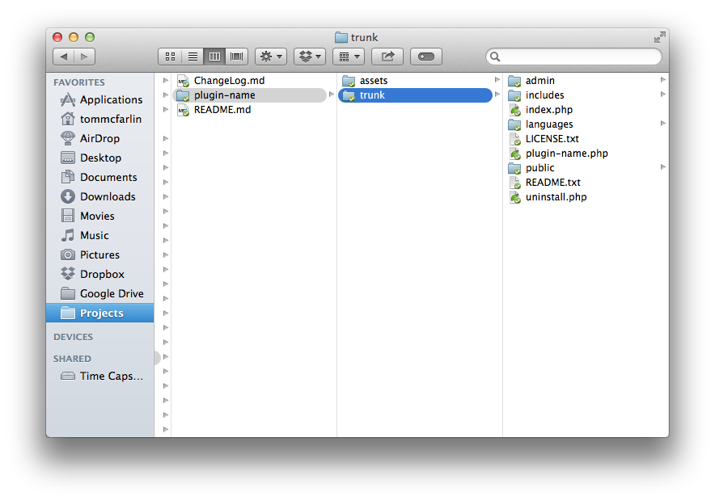

     

# What is a plugin?

A plug-in is a small program, or combination of programs, that sits on top of your WordPress installation and increases the functionality of your website in some way. (Translation: Plug-ins allow your blog to have more features and to do more than it could when you first installed it.) Most plug-ins are written in the PHP scripting language and add an additional feature or function to your website.

Plug-ins integrate seamlessly with WordPress so there’s no messing with your WordPress code. That’s another great thing about plug-ins. They don’t actually affect your original WordPress install. They reside separately and interact with WordPress.
H
## How did plug-ins get “invented”?

The development of plug-ins came about by programmers who wanted to increase the function of WordPress without having to alter the code within WordPress itself. Basically, programmers said “I wish WordPress could do this extra thing” – and then created plug-ins to make it happen. Of course other developers got excited by this and it spread. More and more developers jumped on board and created these small add-ons to the WordPress code and now WordPress can do more than the original creators ever dreamed it could simply due to these little plug-ins.

The vast majority of plug-ins are free and therefore it is important to understand that they do not come with technical support services. When choosing a plug-in, it is wise to evaluate the following:

• How long it has been since that plug-in was updated.
• What version – or versions – of WordPress is the plug-in compatible with.
• Whether the plug-in homepage still exists.
• If people seeking support on the plug-in have received answers to their questions.
• The overall tone of the discussions on the plug-in download page.

There is a plug-in for virtually anything you want to accomplish in WordPress. Visit your dashboard and look for the menu item “plug ins” to find or search for the plug ins you want.  If you want to monitor your visitor statistics, increase interaction with your visitors, add a photo gallery, automatically back up your database or anything else you have a desire to do with your site, you can most likely find a plug-in to use, and like we said, most of them are free

## The WordPress [Plugin Boilerplate 3.0.0](https://tommcfarlin.com/wordpress-plugin-boilerplate-3/)

### The Homepage

The WordPress Plugin Boilerplate Homepage

First, the project has an [official homepage](http://wppb.io/) for making the project more accessible to those who are just jumping into the foray of writing WordPress plugins.

### A Total Rewrite

As mentioned throughout several previous blog posts, the Boilerplate underwent a complete rewrite. This means the project started at ground zero and was built upwards from there.

So what does this look like?

The WordPress Plugin Boilerplate Directory Structure

As you can see, the project itself includes its own `README` and `ChangeLog` and then the rest of the project is broken down into two directories:

1. `assets`
1. `trunk`

For anyone who as submitted a plugin to the WordPress plugin repository, then you’re familiar with the standard Subversion directory structure. The Boilerplate now mimics that.

The `assets` directory contains placeholders for plugin headers, plugin icons (which are a [new addition](http://make.wordpress.org/core/2014/08/21/introducing-plugin-icons-in-the-plugin-installer/) coming in WordPress 4.0), and a screenshot that corresponds to the contents of the plugin’s `readme.txt`.

The `trunk` contains the actual Boilerplate source code. This is a functioning plugin that can be installed and run within WordPress all of which I talk more about momentarily.

The directory structure of `trunk` has changed a bit since this previous version of the Boilerplate. Ultimately, the goal was to create better file organization, a better class architecture, and generally a more organized approach to working with plugins.

* `admin` is used for all dashboard-specific functionality
* `includes` is used for all shared functionality either as part of the core of the plugin or for a third-party library
* `languages` are where the i18n files are kept
* `public` is where all public-facing functionality is kept

Naturally, there are subdirectories to each of these directories, as well; however, rather than spend time going through each and every file, you can read the comments contained in each one to get an idea as to how they all work together.

This means that the Boilerplate no longer uses the `TODO` placeholders. Instead, the comment blocks explain exactly what’s going on and are left for you to change the content during implementation of your work.

### The Loader

There are a number of classes that are located in the `includes` directory such as the activator, deactivator, and more. But the newest addition to the project is The Loader (in context of the Boilerplate, this class is called `Plugin_Name_Loader`.)

The goal of this file is to encapsulate the registration of hooks and then execute both actions and filters at the appropriate time when the plugin is loaded.

Based on the feedback I’ve gotten, this particular class is the one thing that’s resulted in people asking the most questions, sharing that they aren’t sure how they feel about, sharing that they dislike it, and sharing that they love it.

Such is the nature of programming.

Regardless, this helps to easily manage hooks throughout the plugin as you’re working on your code, and you can trust that everything will be registered with WordPress just as you would expect.

### Up To Standards

One of the things that I think we should all be doing is adhering to the WordPress Coding Standards and the Inline Documentation Standards. To that end, the Boilerplate has come done the best possible job at attempting to adhere to both of those.

If you find something that needs changing or think something needs to be removed, issue a pull requests, I’ll review, and I’ll be happy to merge.

Ultimately, the point is to get more people using the standards as defined in the Codex to write more WordPress-specific and maintainable code.

 

 

http://wppb.me/
